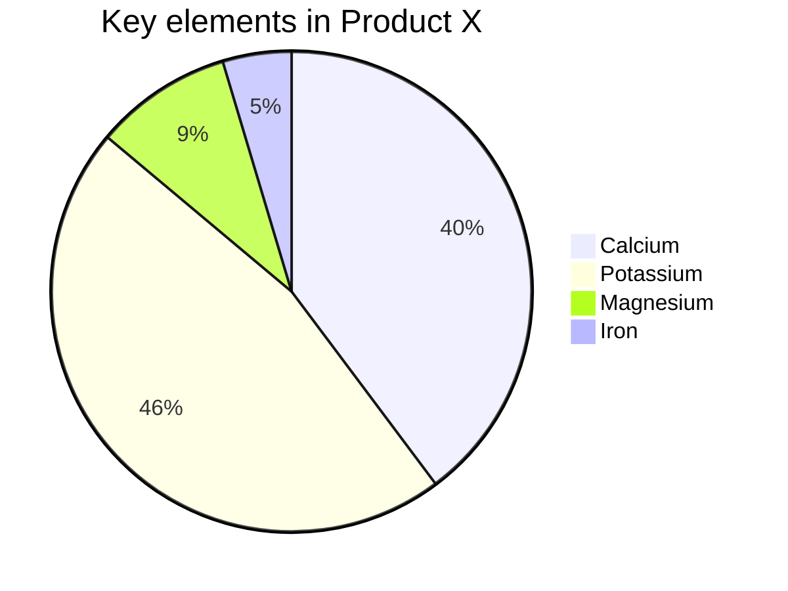
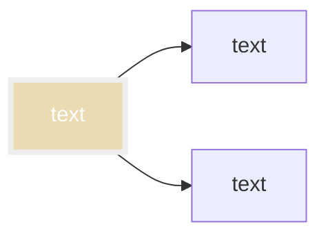
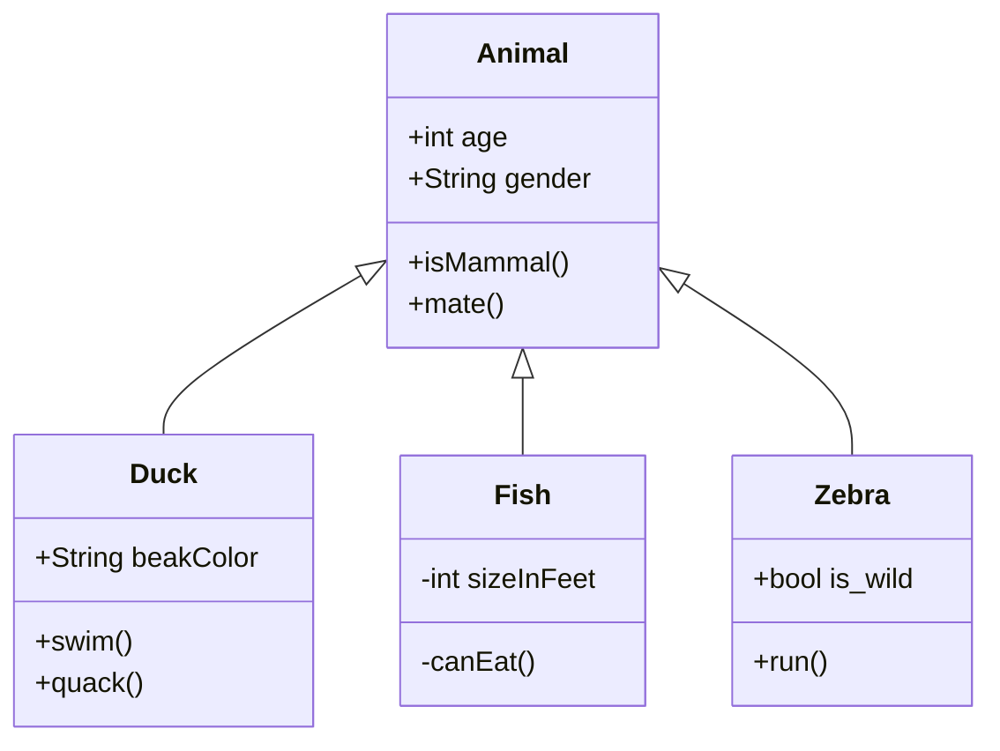
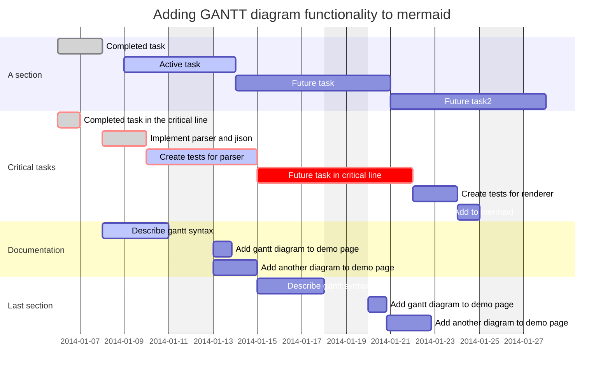
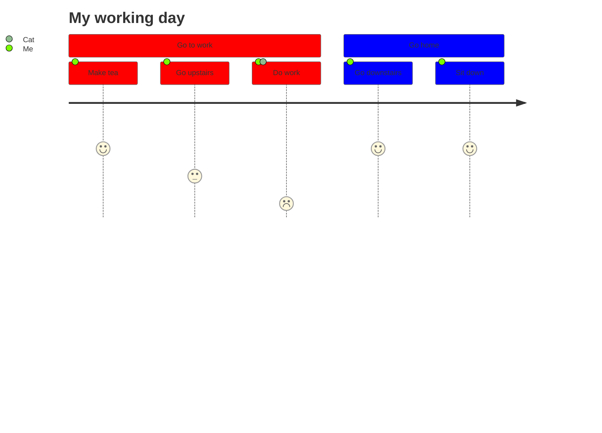
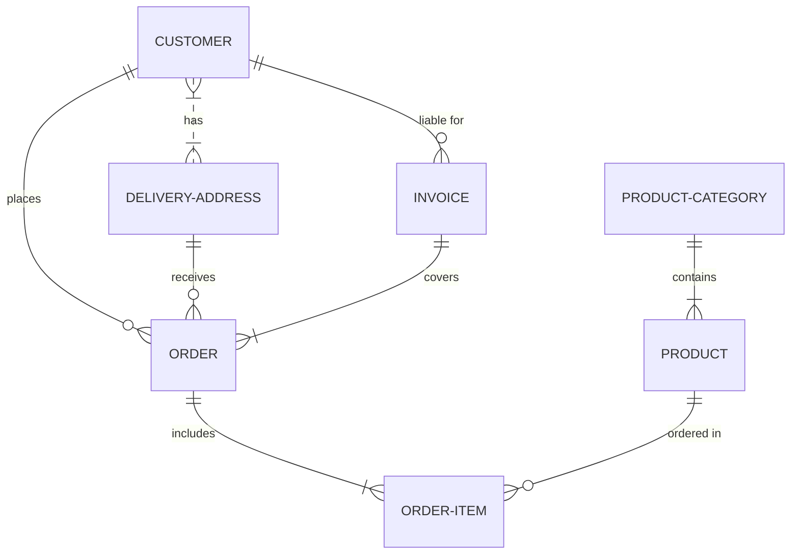
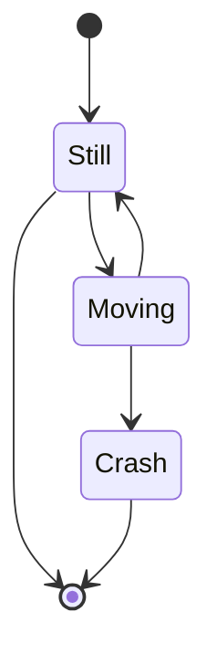
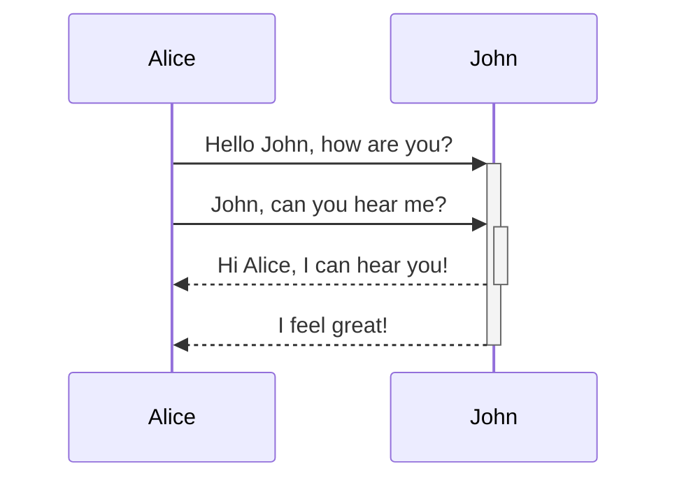

---
alias:
- Mermaid
type: programing
---
# Markdown Mermaid

## Syntax

Mermaid is one of those [JavaScript](https://publish.obsidian.md/bryan-jenks/DevLog/Notes/JavaScript) library additions that can simply hijack the code fence syntax to add new functionality like diagrams.

````
```mermaid
<CODE HERE>
```
````

### Resources

[mermaid live editor](https://mermaid-js.github.io/mermaid-live-editor/#/edit/eyJjb2RlIjoiZ3JhcGggVERcbiAgQVtDaHJpc3RtYXNdIC0tPnxHZXQgbW9uZXl8IEIoR28gc2hvcHBpbmcpXG4gIEIgLS0-IEN7TGV0IG1lIHRoaW5rfVxuICBDIC0tPnxPbmV8IERbTGFwdG9wXVxuICBDIC0tPnxUd298IEVbaVBob25lXVxuICBDIC0tPnxUaHJlZXwgRltmYTpmYS1jYXIgQ2FyXVxuXHRcdCIsIm1lcm1haWQiOnsidGhlbWUiOiJkZWZhdWx0In19)

## Diagram Types

### Pie Chart

````

````


### FlowChart

````

````


[mermaid live editor](https://mermaid-js.github.io/mermaid-live-editor/#/edit/eyJjb2RlIjoiZ3JhcGggVERcbiAgQVtDaHJpc3RtYXNdIC0tPnxHZXQgbW9uZXl8IEIoR28gc2hvcHBpbmcpXG4gIEIgLS0-IEN7TGV0IG1lIHRoaW5rfVxuICBDIC0tPnxPbmV8IERbTGFwdG9wXVxuICBDIC0tPnxUd298IEVbaVBob25lXVxuICBDIC0tPnxUaHJlZXwgRltmYTpmYS1jYXIgQ2FyXVxuXHRcdCIsIm1lcm1haWQiOnsidGhlbWUiOiJkZWZhdWx0In19)

### Class Diagrams

````

````


[mermaid live editor](https://mermaid-js.github.io/mermaid-live-editor/#/edit/eyJjb2RlIjoiY2xhc3NEaWFncmFtXG4gICAgQW5pbWFsIDx8LS0gRHVja1xuICAgIEFuaW1hbCA8fC0tIEZpc2hcbiAgICBBbmltYWwgPHwtLSBaZWJyYVxuICAgIEFuaW1hbCA6ICtpbnQgYWdlXG4gICAgQW5pbWFsIDogK1N0cmluZyBnZW5kZXJcbiAgICBBbmltYWw6ICtpc01hbW1hbCgpXG4gICAgQW5pbWFsOiArbWF0ZSgpXG4gICAgY2xhc3MgRHVja3tcbiAgICAgICtTdHJpbmcgYmVha0NvbG9yXG4gICAgICArc3dpbSgpXG4gICAgICArcXVhY2soKVxuICAgIH1cbiAgICBjbGFzcyBGaXNoe1xuICAgICAgLWludCBzaXplSW5GZWV0XG4gICAgICAtY2FuRWF0KClcbiAgICB9XG4gICAgY2xhc3MgWmVicmF7XG4gICAgICArYm9vbCBpc193aWxkXG4gICAgICArcnVuKClcbiAgICB9XG4gICAgICAgICAgICAiLCJtZXJtYWlkIjp7InRoZW1lIjoiZGVmYXVsdCJ9LCJ1cGRhdGVFZGl0b3IiOmZhbHNlfQ)

### Git Graph

````

````

### Gantt Chart

````

````


[mermaid live editor](https://mermaid-js.github.io/mermaid-live-editor/#/edit/eyJjb2RlIjoiZ2FudHRcbiAgICB0aXRsZSBBIEdhbnR0IERpYWdyYW1cbiAgICBkYXRlRm9ybWF0ICBZWVlZLU1NLUREXG4gICAgc2VjdGlvbiBTZWN0aW9uXG4gICAgQSB0YXNrICAgICAgICAgICA6YTEsIDIwMTQtMDEtMDEsIDMwZFxuICAgIEFub3RoZXIgdGFzayAgICAgOmFmdGVyIGExICAsIDIwZFxuICAgIHNlY3Rpb24gQW5vdGhlclxuICAgIFRhc2sgaW4gc2VjICAgICAgOjIwMTQtMDEtMTIgICwgMTJkXG4gICAgYW5vdGhlciB0YXNrICAgICAgOiAyNGRcbiAgICAgICAgICAgICIsIm1lcm1haWQiOnsidGhlbWUiOiJkZWZhdWx0In0sInVwZGF0ZUVkaXRvciI6ZmFsc2V9)

### Journey Diagram

````

````


### ER Diagram

````

````


[mermaid live editor](https://mermaid-js.github.io/mermaid-live-editor/#/edit/eyJjb2RlIjoiZXJEaWFncmFtXG4gICAgICAgICAgQ1VTVE9NRVIgfXwuLnx7IERFTElWRVJZLUFERFJFU1MgOiBoYXNcbiAgICAgICAgICBDVVNUT01FUiB8fC0tb3sgT1JERVIgOiBwbGFjZXNcbiAgICAgICAgICBDVVNUT01FUiB8fC0tb3sgSU5WT0lDRSA6IFwibGlhYmxlIGZvclwiXG4gICAgICAgICAgREVMSVZFUlktQUREUkVTUyB8fC0tb3sgT1JERVIgOiByZWNlaXZlc1xuICAgICAgICAgIElOVk9JQ0UgfHwtLXx7IE9SREVSIDogY292ZXJzXG4gICAgICAgICAgT1JERVIgfHwtLXx7IE9SREVSLUlURU0gOiBpbmNsdWRlc1xuICAgICAgICAgIFBST0RVQ1QtQ0FURUdPUlkgfHwtLXx7IFBST0RVQ1QgOiBjb250YWluc1xuICAgICAgICAgIFBST0RVQ1QgfHwtLW97IE9SREVSLUlURU0gOiBcIm9yZGVyZWQgaW5cIiIsIm1lcm1haWQiOnsidGhlbWUiOiJkZWZhdWx0In0sInVwZGF0ZUVkaXRvciI6ZmFsc2V9)

### State Diagram

````

````


[mermaid live editor](https://mermaid-js.github.io/mermaid-live-editor/#/edit/eyJjb2RlIjoic3RhdGVEaWFncmFtLXYyXG4gICAgWypdIC0tPiBTdGlsbFxuICAgIFN0aWxsIC0tPiBbKl1cbiAgICBTdGlsbCAtLT4gTW92aW5nXG4gICAgTW92aW5nIC0tPiBTdGlsbFxuICAgIE1vdmluZyAtLT4gQ3Jhc2hcbiAgICBDcmFzaCAtLT4gWypdIiwibWVybWFpZCI6eyJ0aGVtZSI6ImRlZmF1bHQifSwidXBkYXRlRWRpdG9yIjpmYWxzZX0)

### Sequence Diagram

````

````


[mermaid live editor](https://mermaid-js.github.io/mermaid-live-editor/#/edit/eyJjb2RlIjoic2VxdWVuY2VEaWFncmFtXG4gICAgQWxpY2UtPj4rSm9objogSGVsbG8gSm9obiwgaG93IGFyZSB5b3U_XG4gICAgQWxpY2UtPj4rSm9objogSm9obiwgY2FuIHlvdSBoZWFyIG1lP1xuICAgIEpvaG4tLT4-LUFsaWNlOiBIaSBBbGljZSwgSSBjYW4gaGVhciB5b3UhXG4gICAgSm9obi0tPj4tQWxpY2U6IEkgZmVlbCBncmVhdCEiLCJtZXJtYWlkIjp7InRoZW1lIjoiZGVmYXVsdCJ9LCJ1cGRhdGVFZGl0b3IiOmZhbHNlfQ)